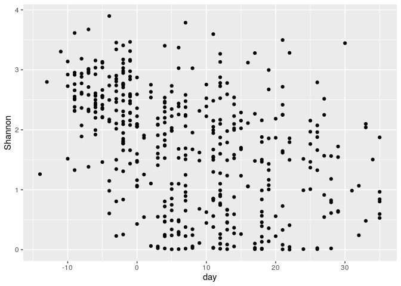
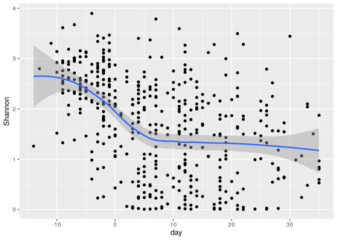
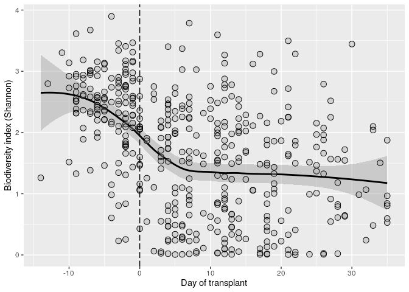

CID Diversity Plot
================

In this example we will generate a plot of diversity. This is the same plot that was published as [Figure 1 in the Clin Infect Dis (2012) paper](https://www.ncbi.nlm.nih.gov/pmc/articles/PMC3657523/figure/CIS580F1/).

``` r
library(tidyverse)
library(yingtools2)
library(phyloseq)
knitr::kable(mtcars)
```

|                     |   mpg|  cyl|   disp|   hp|  drat|     wt|   qsec|   vs|   am|  gear|  carb|
|:--------------------|-----:|----:|------:|----:|-----:|------:|------:|----:|----:|-----:|-----:|
| Mazda RX4           |  21.0|    6|  160.0|  110|  3.90|  2.620|  16.46|    0|    1|     4|     4|
| Mazda RX4 Wag       |  21.0|    6|  160.0|  110|  3.90|  2.875|  17.02|    0|    1|     4|     4|
| Datsun 710          |  22.8|    4|  108.0|   93|  3.85|  2.320|  18.61|    1|    1|     4|     1|
| Hornet 4 Drive      |  21.4|    6|  258.0|  110|  3.08|  3.215|  19.44|    1|    0|     3|     1|
| Hornet Sportabout   |  18.7|    8|  360.0|  175|  3.15|  3.440|  17.02|    0|    0|     3|     2|
| Valiant             |  18.1|    6|  225.0|  105|  2.76|  3.460|  20.22|    1|    0|     3|     1|
| Duster 360          |  14.3|    8|  360.0|  245|  3.21|  3.570|  15.84|    0|    0|     3|     4|
| Merc 240D           |  24.4|    4|  146.7|   62|  3.69|  3.190|  20.00|    1|    0|     4|     2|
| Merc 230            |  22.8|    4|  140.8|   95|  3.92|  3.150|  22.90|    1|    0|     4|     2|
| Merc 280            |  19.2|    6|  167.6|  123|  3.92|  3.440|  18.30|    1|    0|     4|     4|
| Merc 280C           |  17.8|    6|  167.6|  123|  3.92|  3.440|  18.90|    1|    0|     4|     4|
| Merc 450SE          |  16.4|    8|  275.8|  180|  3.07|  4.070|  17.40|    0|    0|     3|     3|
| Merc 450SL          |  17.3|    8|  275.8|  180|  3.07|  3.730|  17.60|    0|    0|     3|     3|
| Merc 450SLC         |  15.2|    8|  275.8|  180|  3.07|  3.780|  18.00|    0|    0|     3|     3|
| Cadillac Fleetwood  |  10.4|    8|  472.0|  205|  2.93|  5.250|  17.98|    0|    0|     3|     4|
| Lincoln Continental |  10.4|    8|  460.0|  215|  3.00|  5.424|  17.82|    0|    0|     3|     4|
| Chrysler Imperial   |  14.7|    8|  440.0|  230|  3.23|  5.345|  17.42|    0|    0|     3|     4|
| Fiat 128            |  32.4|    4|   78.7|   66|  4.08|  2.200|  19.47|    1|    1|     4|     1|
| Honda Civic         |  30.4|    4|   75.7|   52|  4.93|  1.615|  18.52|    1|    1|     4|     2|
| Toyota Corolla      |  33.9|    4|   71.1|   65|  4.22|  1.835|  19.90|    1|    1|     4|     1|
| Toyota Corona       |  21.5|    4|  120.1|   97|  3.70|  2.465|  20.01|    1|    0|     3|     1|
| Dodge Challenger    |  15.5|    8|  318.0|  150|  2.76|  3.520|  16.87|    0|    0|     3|     2|
| AMC Javelin         |  15.2|    8|  304.0|  150|  3.15|  3.435|  17.30|    0|    0|     3|     2|
| Camaro Z28          |  13.3|    8|  350.0|  245|  3.73|  3.840|  15.41|    0|    0|     3|     4|
| Pontiac Firebird    |  19.2|    8|  400.0|  175|  3.08|  3.845|  17.05|    0|    0|     3|     2|
| Fiat X1-9           |  27.3|    4|   79.0|   66|  4.08|  1.935|  18.90|    1|    1|     4|     1|
| Porsche 914-2       |  26.0|    4|  120.3|   91|  4.43|  2.140|  16.70|    0|    1|     5|     2|
| Lotus Europa        |  30.4|    4|   95.1|  113|  3.77|  1.513|  16.90|    1|    1|     5|     2|
| Ford Pantera L      |  15.8|    8|  351.0|  264|  4.22|  3.170|  14.50|    0|    1|     5|     4|
| Ferrari Dino        |  19.7|    6|  145.0|  175|  3.62|  2.770|  15.50|    0|    1|     5|     6|
| Maserati Bora       |  15.0|    8|  301.0|  335|  3.54|  3.570|  14.60|    0|    1|     5|     8|
| Volvo 142E          |  21.4|    4|  121.0|  109|  4.11|  2.780|  18.60|    1|    1|     4|     2|

Use `get.samp()` to extract the sample data from the phyloseq object. By specifying `stats=TRUE`, you can calculate alpha diversity for each sample. Note that several types of diversity are calculated.

``` r
s <- get.samp(cid.phy,stats=TRUE)
s
```

    ## # A tibble: 439 x 10
    ##   sample Sample_ID Patient_ID   day day.old Consistency  nseqs Observed Shannon InvSimpson
    ##   <chr>  <chr>     <chr>      <dbl>   <dbl> <chr>        <dbl>    <dbl>   <dbl>      <dbl>
    ## 1 1037   1037      301           -1      -1 liquid        1977       88   2.60        7.23
    ## 2 1039   1039      301           15      15 semi-formed   1238       16   0.261       1.10
    ## 3 1040   1040      301           22      22 semi-formed   5192       31   0.409       1.24
    ## 4 1041   1041      301           28      28 semi-formed   1267       13   0.790       1.98
    ## 5 1042   1042      301           35      35 formed stool  1038        8   0.805       2.02
    ## 6 1038   1038      301            9       9 semi-formed   1181       39   1.62        3.03
    ## 7 1105   1105      318           -6      -6 formed stool  5182       60   2.00        4.03
    ## 8 1106   1106      318            1       1 formed stool  4251       31   0.544       1.24
    ## # … with 431 more rows

With this table you can now plot:

``` r
ggplot(s,aes(x=day,y=Shannon)) + geom_point()
```



We can add a smoothed conditional mean to the plot:

``` r
ggplot(s,aes(x=day,y=Shannon)) + geom_point() + geom_smooth()
```



This is fairly equivalent to Figure 1 in the CID 2012 paper. To make it match that plot even more closely, you could perform the following aesthetic operations: (1) change the X and Y axis titles, using `xlab` and `ylab`, (2) add a verticle line at X=0 to indicate the time of stem cell infusion, (3) change the color of the smoothed mean to black, (4) change the shape and color of the points to match, and specify `alpha` to make them slightly translucent, (5) draw the perimeter of the points in a separate layer (because those are not translucent), (6) change the order of the layers, such that the points are drawn over the smoothed mean.

``` r
ggplot(s,aes(x=day,y=Shannon)) + 
  geom_smooth(color="black") + 
  geom_point(shape=16,color="dark gray",size=3,alpha=0.4) +
  geom_point(shape=1,size=3) + 
  geom_vline(xintercept=0,linetype="longdash") +
  xlab("Day of transplant") +
  ylab("Biodiversity index (Shannon)")
```


