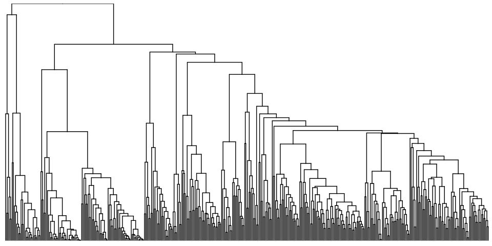
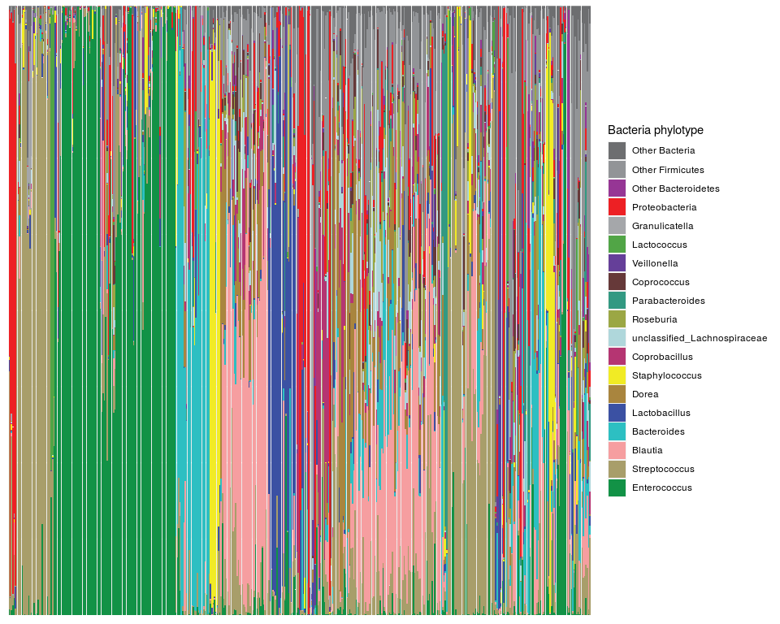
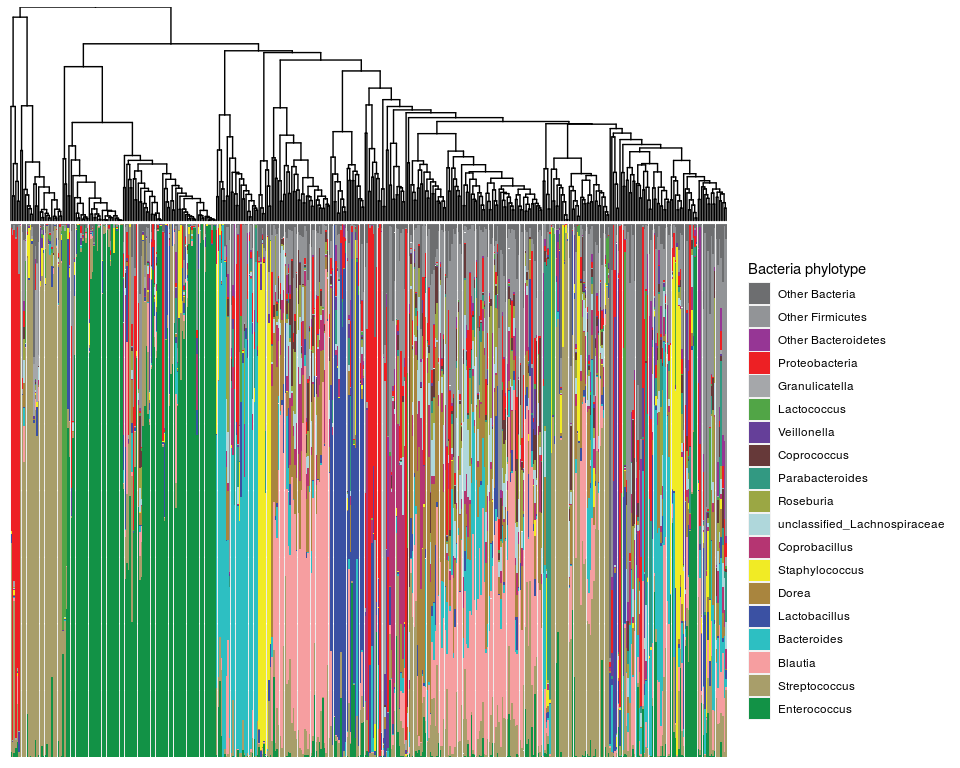

CID Hierarchical Clustering
================

In this example we are attempting to recreate Figure 3A, a hierarchical cluster of the taxa.

``` r
library(tidyverse)
library(yingtools2)
library(phyloseq)
library(ggtree)
library(ape)
```

First collapse the phyloseq into genus level, which is level at which we clustered. Note, the 'taxon' column is just a recoding of genus and other levels, to be used for plot legend. Then use `distance` to create a euclidean distance matrix, and `hclust()` to create an hclust object, which can be plotted as a tree using `ggtree` package.

``` r
phy <- cid.phy %>% phy.collapse(taxranks=c("Kingdom", "Phylum", "Class", "Order", "Family", "Genus", "taxon"))
dist <- distance(phy,"euclidean")
hc <- hclust(dist)
tr <- as.phylo(hc)
gt <- ggtree(tr)
xlim <- gt$data$y %>% range()
g.hc <- gt + scale_x_reverse() + coord_flip(ylim=xlim,expand=FALSE) 
g.hc
```



Next I want to create a stacked bar plot portion. I need to make sure the order of the samples is the same as determined by the hierarchical clustering done above.

``` r
map <- g.hc$data %>% filter(isTip) %>% select(x=y,sample=label)
otu <- cid.phy %>% get.otu.melt() %>%
  mutate(taxon=factor(taxon,levels=rev(names(cid.colors)))) %>%
  left_join(map,by="sample")
g.tax <- ggplot(otu,aes(x=x,y=pctseqs,fill=taxon)) + geom_col() +
  scale_fill_manual("Bacteria phylotype",values=cid.colors) +
  coord_cartesian(xlim=xlim,expand=FALSE) +
  theme(axis.text=element_blank(),axis.title=element_blank(),axis.ticks=element_blank())
g.tax
```



I can put these together using `gg.stack`.

``` r
gg.stack(g.hc,g.tax,heights=c(2,5))
```


