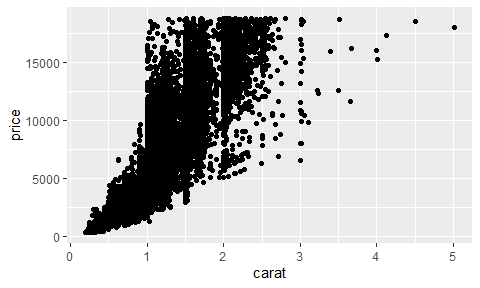
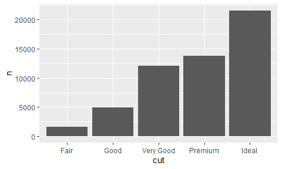
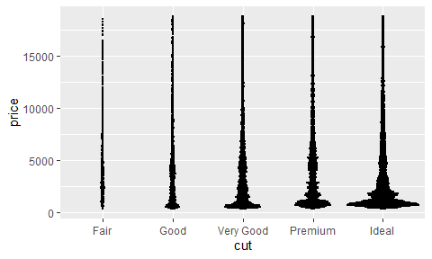
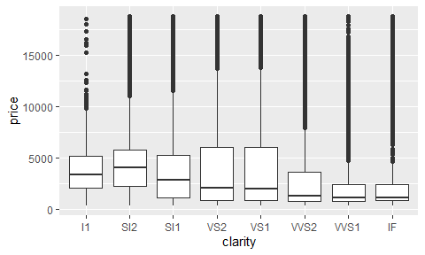

Curriculum
================

``` r
library(tidyverse)
library(yingtools2)
library(phyloseq)
```

### Basic vector manipulations

Datasets used here: `rivers` (numeric vector), `sentences` (character
vector), `state.division` (factor vector), `airquality` (data frame)

| Task                                                   | Code                                                                                                                                            |
|:-------------------------------------------------------|:------------------------------------------------------------------------------------------------------------------------------------------------|
| Length of a vector                                     | `length(rivers)`                                                                                                                                |
| First element of a vector                              | `rivers[1]` -or-</br>`first(rivers)`                                                                                                            |
| Last element of a vector                               | `rivers[length(rivers)]` -or-</br>`last(rivers)`                                                                                                |
| Subset by logical condition                            | `rivers[rivers>700]`                                                                                                                            |
| Count number of elements that meet a condition         | `sum(rivers>700)`                                                                                                                               |
| Calculate proportion of elements that meet a condition | `mean(rivers>700)`                                                                                                                              |
| Extract a single column from a data frame              | `airquality$Ozone` -or-</br>`airquality[,1]` -or-</br>`airquality[,"Ozone"]` -or-</br>`airquality[["Ozone"]]` -or-</br>`pull(airquality,Ozone)` |
| Test a vector for `NA` values                          | `is.na(airquality$Ozone)`                                                                                                                       |
| Sort a variable                                        | `rivers[order(rivers)]` -or-</br>`sort(rivers)`                                                                                                 |
| Count the number of distinct values                    | `length(unique(state.division))` -or-</br>`n_distinct(state.division)`                                                                          |
| Search for text using regular expressions              | `grepl("dog&#124;cat",sentences)` -or-</br>`str_detect(sentences,"dog&#124;cat")`                                                               |
| Split a character vector using a separator             | `str_split(sentences, pattern=" ")`                                                                                                             |
| Tabulate a vector’s values                             | `tab(state.division)` -or-</br>`table(state.division)` -or-</br>`fct_count(state.division)`                                                     |

### Recoding variables

Datasets used here: `state.division` (factor vector)

| Task                                                                            | Code                                                                                                                     |
|:--------------------------------------------------------------------------------|:-------------------------------------------------------------------------------------------------------------------------|
| Reorder factor levels based on decreasing frequency                             | `fct_infreq(state.division)`                                                                                             |
| Reorder factor levels based on another vector                                   | `fct_reorder(state.division,state.area,.fun=sum)`                                                                        |
| Reorder factor levels based on its current order                                | `fct_inorder(state.division)` -or-</br>`factor(state.division,levels=unique(state.division))`                            |
| Collapse less frequent factor levels into “other”                               | `fct_lump_n(state.division, 4)`                                                                                          |
| Manually recode factor levels                                                   | `recode(state.division, "Middle Atlantic"="Mid Atl")` -or-</br>`fct_recode(state.division, "Mid Atl"="Middle Atlantic")` |
| Recode a character based on multiple regular expression criteria (`yingtools2`) | `recode.grep(state.division, recodes=c("central"="Central", "atlantic&#124;new england"="Atlantic"))`                    |

### Basic data frame manipulations

Datasets used here: `mtcars` (data frame), `band_members` (data frame),
`band_instruments` (data frame), `starwars` (data frame), `relig_income`
(data frame), `us_rent_income` (data frame)

| Task                                        | Code                                                                                                                                                                                                                                                                             |
|:--------------------------------------------|:---------------------------------------------------------------------------------------------------------------------------------------------------------------------------------------------------------------------------------------------------------------------------------|
| Sort a data frame by a column               | `arrange(mtcars,mpg)` -or-</br>`mtcars[order(mtcars$mpg),]`                                                                                                                                                                                                                      |
| Subset the rows based on column criteria    | (cars that have &gt;15 mpg and 6 cylinders)</br>`filter(mtcars,mpg>15,cyl==6)` -or-</br>`subset(mtcars,mpg>15 & cyl==6)` -or-</br>`mtcars[mtcars$mpg>15 & mtcars$cyl==6,]`                                                                                                       |
| Select specific columns from a data frame   | `select(mtcars,mpg,cyl,disp)` -or-</br>`subset(mtcars,select=c(mpg,cyl,disp))` -or-</br>`mtcars[,c("mpg","cyl","disp")]` -or-</br>`mtcars[,1:3]`                                                                                                                                 |
| Tabulate a column                           | `mtcars %>% count(cyl)` -or-</br>`mtcars %>% group_by(cyl) %>% tally()` -or-</br>`mtcars %>% group_by(cyl) %>% summarize(n=n()) %>% ungroup()`                                                                                                                                   |
| Inner join 2 data frames                    | (only keep rows that match)</br>`band_members %>% inner_join(band_instruments,by="name")`                                                                                                                                                                                        |
| Left join 2 data frames                     | (keep all rows from band)</br>`band_members %>% left_join(band_instruments,by="name")`                                                                                                                                                                                           |
| Calculate summary statistics across a group | (average height/weight across all species)</br>`starwars %>% group_by(species) %>% summarize(mean.height=mean(height),mean.weight=mean(mass))`                                                                                                                                   |
| Pivot Longer/Melt a data frame              | `relig_income %>% pivot_longer(!religion,names_to="income",values_to="count")` -or-</br>`relig_income %>% gather(key="income", value="count", -religion)` -or-</br>`relig_income %>% reshape2::melt(id.vars="religion",variable.name="income",value.name="count")`               |
| Pivot Wider/Cast a data frame               | `us_rent_income %>% pivot_wider(id_cols = NAME, names_from = variable, values_from = estimate)` -or-</br>`us_rent_income %>% select(-moe,-GEOID) %>% spread(key=variable,value=estimate)` -or-</br>`us_rent_income %>% reshape2::dcast(NAME ~ variable, value.var = "estimate")` |

### ggplot2 tasks

Dataset used here: `diamonds` (ggplot2 package)

| Task                                | Code                                                                                                                 | Plot                                            |
|:------------------------------------|:---------------------------------------------------------------------------------------------------------------------|:------------------------------------------------|
| histogram                           | `ggplot(diamonds, aes(x = price)) + geom_histogram()`                                                                |  |
| histogram with custom fixed colors  | `ggplot(diamonds, aes(x = price)) + geom_histogram(color = "black", fill = "pink")`                                  |  |
| scatterplot                         | `ggplot(diamonds, aes(x = carat, y = price)) + geom_point()`                                                         |  |
| barplot (height count)              | `ggplot(diamonds, aes(x = color)) + geom_bar()`                                                                      |  |
| barplot (height manually specified) | `diamonds %>%`</br>`count(cut) %>%`</br>`ggplot(aes(x = cut, y = n)) + geom_col()`                                   |  |
| boxplot                             | `ggplot(diamonds, aes(x = clarity, y = price)) + geom_boxplot()`                                                     |  |
| dotplot                             | `ggplot(diamonds, aes(x = cut, y = price)) + geom_dotplot(binaxis = "y", stackdir = "center", binwidth = 20)`        |  |
| heatmap                             | `d <- diamonds %>%`</br>`count(clarity, color)`</br>`ggplot(d, aes(x = clarity, y = color, fill = n)) + geom_tile()` |  |

### Phyloseq tasks

Datasets used here: `cid.phy` (yingtools2 package)

| Task                                                            | Code                                                                                            |
|:----------------------------------------------------------------|:------------------------------------------------------------------------------------------------|
| Get sample data (rows=samples)                                  | `get.samp(cid.phy)`                                                                             |
| Get sample data and calculate alpha diversity                   | `get.samp(cid.phy,stats=TRUE)`                                                                  |
| Get tax table (rows=taxa)                                       | `get.tax(cid.phy)`                                                                              |
| Get combined long table of tax abundances (rows=samples x taxa) | `get.otu.melt(cid.phy)`                                                                         |
| Collapse phyloseq by genus level                                | `phy.collapse(cid.phy,taxranks=c("Superkingdom","Phylum","Class", "Order", "Family", "Genus"))` |
| Subset of samples with liquid consistency                       | `subset_samples(cid.phy,Consistency=="liquid")`                                                 |
| Remove samples with fewer than 1000 seqs                        | `prune_samples(sample_sums(cid.phy)>=1000,cid.phy)`                                             |
