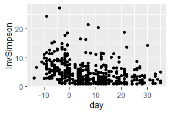
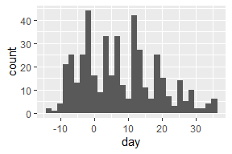
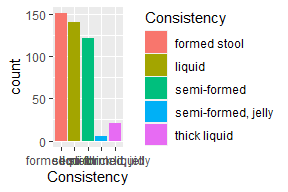
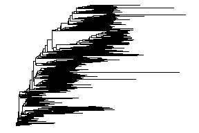
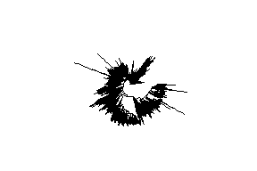
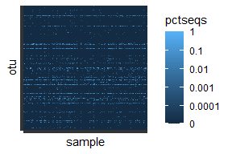

Curriculum
================

``` r
library(tidyverse)
library(yingtools2)
library(phyloseq)
library(scales)
library(ggtree)
library(survival)
```

### R tasks to learn

Datasets used here: `rivers` (numeric vector), `sentences` (character
vector), `state.division` (factor vector)

| Task                                                   | Code                                                                    |
|:-------------------------------------------------------|:------------------------------------------------------------------------|
| Length of a vector                                     | `length(rivers)`                                                        |
| Subset a vector by index                               | `rivers[3]`                                                             |
| Subset by logical condition                            | `rivers[rivers>700]`                                                    |
| Count number of elements that meet a condition         | `sum(rivers>700)`                                                       |
| Calculate proportion of elements that meet a condition | `mean(rivers>700)`                                                      |
| Sort a variable                                        | `rivers[order(rivers)]; sort(rivers)`                                   |
| Count the number of distinct values                    | `length(unique(state.division)); n_distinct(state.division)`            |
| Relevel a factor based on frequency                    | `fct_infreq(state.division)`                                            |
| Relevel a factor so that small groups are collapsed    | `fct_lump_n(state.division,5)`                                          |
| Search for text using regular expressions              | `grepl("dog&#124;cat",sentences); str_detect(sentences,"dog&#124;cat")` |
| Split sentences into a list of words                   | `str_split(sentences,pattern=" ")`                                      |

### Data frames

Datasets used here: `starwars`

| Task                                                | Code                                              |
|:----------------------------------------------------|:--------------------------------------------------|
| Left join                                           | `left_join(x,y,by="var")`                         |
| Inner join                                          | `inner_join(x,y,by="var")`                        |
| Read a CSV file                                     | `read_csv(...)`                                   |
| Group by                                            | `data %>% group_by(...) %>% [code] %>% ungroup()` |
| Melt                                                | `data %>% pivot_longer(...)`                      |
| Cast                                                | `data %>% pivot_wider(...)`                       |
| Split a column into several columns                 | `data %>% separate(...)`                          |
| recode a character based on multiple regex criteria | `recode.grep(vec,c("abc"="def"))`                 |

### Phyloseq tasks

Datasets used here: `cid.phy`

| Task                                                            | Code                                                                                            |
|:----------------------------------------------------------------|:------------------------------------------------------------------------------------------------|
| Get sample data (rows=samples)                                  | `get.samp(cid.phy)`                                                                             |
| Get sample data and calculate alpha diversity                   | `get.samp(cid.phy,stats=TRUE)`                                                                  |
| Get tax table (rows=taxa)                                       | `get.tax(cid.phy)`                                                                              |
| Get combined long table of tax abundances (rows=samples x taxa) | `get.otu.melt(cid.phy)`                                                                         |
| Collapse phyloseq by Genus                                      | `phy.collapse(cid.phy,taxranks=c("Superkingdom","Phylum","Class", "Order", "Family", "Genus"))` |
| Subset of samples with liquid consistency                       | `subset_samples(cid.phy,Consistency=="liquid")`                                                 |
| Remove samples with fewer than 1000 seqs                        | `prune_samples(sample_sums(cid.phy)>=1000,cid.phy)`                                             |

``` r
s <- get.samp(cid.phy,stats=TRUE)
```

    ## # A tibble: 1 x 6
    ##   yvar    xvar            term            n haz.ratio            p.value
    ##   <chr>   <chr>           <chr>       <int> <chr>                <chr>  
    ## 1 vre.bsi enterodom30(td) enterodom30    35 10.29 (2.30 - 46.12) 0.002

| Task                                 | Code                                                                                                                                                                                                                                                                                          | Plot                                                |
|:-------------------------------------|:----------------------------------------------------------------------------------------------------------------------------------------------------------------------------------------------------------------------------------------------------------------------------------------------|:----------------------------------------------------|
| scatterplot                          | `ggplot(s,aes(x=day,y=InvSimpson)) + geom_point()`                                                                                                                                                                                                                                            |  |
| scatterplot with smoother            | `ggplot(s,aes(x=day,y=InvSimpson)) + geom_point() + geom_smooth()`                                                                                                                                                                                                                            |  |
| histogram                            | `ggplot(s,aes(x=day)) + geom_histogram()`                                                                                                                                                                                                                                                     |  |
| Bar plot                             | `ggplot(s,aes(x=Consistency,fill=Consistency)) + geom_bar()`                                                                                                                                                                                                                                  |  |
| Phylogenetic tree                    | `tr <- phy_tree(cid.phy) ggtree(tr)`                                                                                                                                                                                                                                                          |  |
| Phylogenetic tree with circular tips | `tr <- phy_tree(cid.phy) ggtree(tr,layout="circular")`                                                                                                                                                                                                                                        |  |
| OTU heatmap                          | `otu <- cid.phy %>% phy.collapse(taxranks=c("Kingdom","Phylum","Class","Order","Family","Genus")) %>% get.otu.melt(filter.zero=FALSE) %>% ggplot(aes(x=sample,y=otu,fill=pctseqs)) + geom_tile() + scale_fill_continuous(trans=log_epsilon_trans(0.0001)) + theme(axis.text=element_blank())` |  |
