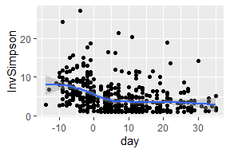

Curriculum
================

``` r
library(tidyverse)
library(yingtools2)
library(phyloseq)
library(scales)
library(knitr)
library(ggtree)
library(survival)
```

### xxsxxxx

xxxxx

| Task                                                | Code                                              |
|:----------------------------------------------------|:--------------------------------------------------|
| Subset a vector by index                            | `x[3]`                                            |
| Subset by condition                                 | `x[x>3]`                                          |
| Sort a variable                                     | `x[order(x)]`                                     |
| Left join                                           | `left_join(x,y,by="var")`                         |
| Inner join                                          | `inner_join(x,y,by="var")`                        |
| Read a CSV file                                     | `read_csv(...)`                                   |
| Group by                                            | `data %>% group_by(...) %>% [code] %>% ungroup()` |
| Melt                                                | `data %>% pivot_longer(...)`                      |
| Cast                                                | `data %>% pivot_wider(...)`                       |
| Split a character vector                            | `str_split("the quick brown fox"," ")`            |
| Split a column into several columns                 | `data %>% separate(...)`                          |
| recode a character based on multiple regex criteria | `recode.grep(vec,c("abc"="def"))`                 |
| xxxxx                                               | `xxxxx`                                           |
| xxxxx                                               | `xxxxx`                                           |

``` r
s <- get.samp(cid.phy,stats=TRUE)
```

    ## # A tibble: 1 x 6
    ##   yvar    xvar            term            n haz.ratio            p.value
    ##   <chr>   <chr>           <chr>       <int> <chr>                <chr>  
    ## 1 vre.bsi enterodom30(td) enterodom30    35 10.29 (2.30 - 46.12) 0.002

| Task                                 | Code                                                                                                                                                                                                                                                                                          | Plot                                                |
|:-------------------------------------|:----------------------------------------------------------------------------------------------------------------------------------------------------------------------------------------------------------------------------------------------------------------------------------------------|:----------------------------------------------------|
| scatterplot                          | `ggplot(s,aes(x=day,y=InvSimpson)) + geom_point()`                                                                                                                                                                                                                                            |  |
| scatterplot with smoother            | `ggplot(s,aes(x=day,y=InvSimpson)) + geom_point() + geom_smooth()`                                                                                                                                                                                                                            |  |
| histogram                            | `ggplot(s,aes(x=day)) + geom_histogram()`                                                                                                                                                                                                                                                     |  |
| Bar plot                             | `ggplot(s,aes(x=Consistency,fill=Consistency)) + geom_bar()`                                                                                                                                                                                                                                  |  |
| Phylogenetic tree                    | `tr <- phy_tree(cid.phy) ggtree(tr)`                                                                                                                                                                                                                                                          |  |
| Phylogenetic tree with circular tips | `tr <- phy_tree(cid.phy) ggtree(tr,layout="circular")`                                                                                                                                                                                                                                        |  |
| OTU heatmap                          | `otu <- cid.phy %>% phy.collapse(taxranks=c("Kingdom","Phylum","Class","Order","Family","Genus")) %>% get.otu.melt(filter.zero=FALSE) %>% ggplot(aes(x=sample,y=otu,fill=pctseqs)) + geom_tile() + scale_fill_continuous(trans=log_epsilon_trans(0.0001)) + theme(axis.text=element_blank())` |  |
