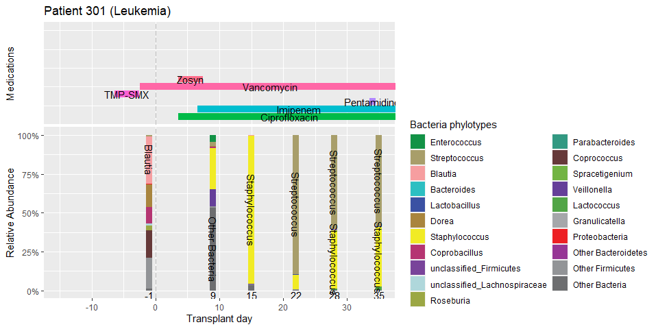

Exercises
================

To complete these exercises, load the following these packages:

``` r
library(tidyverse)
library(phyloseq)
library(yingtools2)
```

For each question, some output is shown from the correct answer in order
to provide guidance.

### Question 1

Look at `cid.patients`. What percent of the patients were black race?
What percent of black patients were female?

    ## [1] 0.06382979

    ## [1] 0.5

6.4% of patients are black. 50.0% of black patients are female.

### Question 2

What percent of the patients were black race? What percent of black
patients were female? In the yingtools2::cid94::cid.bsi data, count the
number of *patients* who had Klebsiella blood stream infections. (hint:
use regular expression).

    ## [1] 7

7 patients had Klebsiella bloodstream infection (note: the answer is not
9)

### Question 3

Start with the `cid.patients` data and make the following modifications:

1.  Make it a subset of patients that are female and underwent a cord
    transplant.

2.  Sort rows by patient’s age at BMT

3.  Create a column called `los` to represent of the hospital length of
    stay for each patient. This is calculated as
    `discharge.day-admit.day+1`.

4.  Create a column called `has.leukemia` which is `TRUE` the patient’s
    primary diagnosis is leukemia, and `FALSE` otherwise.

5.  Keep these columns: `Patient_ID`, `agebmt`, `sex`, `bmt.cord`,
    `los`, `has.leukemia` … remove everything else.

<!-- -->

    ## # A tibble: 10 x 6
    ##   Patient_ID agebmt sex    bmt.cord   los has.leukemia
    ##   <chr>       <dbl> <chr>  <lgl>    <dbl> <lgl>       
    ## 1 232            23 Female TRUE        82 TRUE        
    ## 2 305            29 Female TRUE        50 FALSE       
    ## 3 311            38 Female TRUE        64 FALSE       
    ## 4 303            41 Female TRUE        45 TRUE        
    ## 5 312            46 Female TRUE        52 FALSE       
    ## 6 318            57 Female TRUE        32 TRUE        
    ## 7 191            58 Female TRUE        59 TRUE        
    ## 8 200            63 Female TRUE        56 FALSE       
    ## # ... with 2 more rows

### Question 4

In the `cid.bsi` data, addcolumns to the data in order to show age and
sex for each row (hint: use left\_join).

    ## # A tibble: 138 x 6
    ##   Patient_ID organism               startday endday agebmt sex   
    ##   <chr>      <chr>                     <dbl>  <dbl>  <dbl> <chr> 
    ## 1 228        CNST                         17     17     65 Male  
    ## 2 228        CNST                        247    247     65 Male  
    ## 3 191        Klebsiella pneumoniae         4      4     58 Female
    ## 4 308        CNST                        166    166     60 Female
    ## 5 308        Enterococcus faecalis       166    166     60 Female
    ## 6 308        Pseudomonas aeruginosa      166    166     60 Female
    ## 7 308        Pseudomonas aeruginosa      168    168     60 Female
    ## 8 152        CNST                         90     90     64 Female
    ## # ... with 130 more rows

### Question 5

In `cid.patients`, for each level of `disease.risk`: calculate the
average age, average length of stay, and percent of patients above 60
years (hint: use group\_by).

    ## # A tibble: 3 x 4
    ##   disease.risk mean.age mean.los over60
    ##   <fct>           <dbl>    <dbl>  <dbl>
    ## 1 Low              51.7     44.6 0.407 
    ## 2 Intermediate     47.2     39.6 0.0870
    ## 3 High             50.9     38.5 0.227

### Question 6

Modify `cid.cdiff` so that it lists whether or not the C.diff infection
occurred during inpatient or outpatient.

    ## # A tibble: 37 x 4
    ##   Patient_ID   day method           inpatient 
    ##   <chr>      <dbl> <fct>            <chr>     
    ## 1 112           -1 PCR              inpatient 
    ## 2 142           -2 PCR              inpatient 
    ## 3 145           35 GDH/Cytotoxicity inpatient 
    ## 4 145          172 GDH/Cytotoxicity inpatient 
    ## 5 152          130 GDH/Cytotoxicity inpatient 
    ## 6 152          155 GDH/Cytotoxicity outpatient
    ## 7 152          218 GDH/Cytotoxicity inpatient 
    ## 8 153           -1 PCR              inpatient 
    ## # ... with 29 more rows

### Question 7

Using `cid.bsi`, create a data frame that lists for each patient: (1)
Patient\_ID, (2) age, (3) sex, (4) number of positive blood cultures,
(5) number of distinct organisms, (6) a character listing each distinct
bloodstream organism seen, separated by commas and listed in the order
they first occurred. If a patient did not have positive blood cultures,
state ‘<none>’.

    ## # A tibble: 94 x 6
    ##   Patient_ID agebmt sex    n.poscultures n.orgs org.list                                            
    ##   <chr>       <dbl> <chr>          <dbl>  <dbl> <chr>                                               
    ## 1 112            37 Male               1      1 Bacillus species                                    
    ## 2 114            61 Male               3      3 Fusobacterium species,Leptotrichia trevisanii,Staph~
    ## 3 121            50 Male               2      2 CNST,Staphylococcus aureus oxacillin resistant      
    ## 4 133            54 Female             1      1 CNST                                                
    ## 5 143            25 Male               2      2 Klebsiella pneumoniae,Serratia marcescens           
    ## 6 145            39 Male               7      3 Micrococcus species,CNST,Corynebacterium striatum/a~
    ## 7 152            64 Female             5      2 VRE,CNST                                            
    ## 8 153            62 Female             2      2 VRE,E. coli                                         
    ## # ... with 86 more rows

### Question 8

Create a data frame that lists the number of days each IV antibacterial
drug was given, for each patient.

    ## # A tibble: 89 x 29
    ##   Patient_ID Vancomycin Ciprofloxacin Zosyn Cefepime Metronidazole Azithromycin Aztreonam `TMP-SMX`
    ##   <chr>           <dbl>         <dbl> <dbl>    <dbl>         <dbl>        <dbl>     <dbl>     <dbl>
    ## 1 228                29             9    14       18             3            5         6         0
    ## 2 307                 0             0     3        0             0            1         0         4
    ## 3 191                50             0    42        1             0            0         0         0
    ## 4 308                22            41    53        6             0            0         0         5
    ## 5 320                52            43     2       13            17            0         0         5
    ## 6 194                55             1     0       41             0            4        45         5
    ## 7 152                40            35    63        5             3           16         0         4
    ## 8 309                58            29    62       19             0            0         0         5
    ## # ... with 81 more rows

### Q9

Using `cid.patients`, make a histogram of age.

<!-- -->

### Question 9

Using `cid.patients`, make a bar plot of intensity (with different
colors):

<!-- -->

### Question 10

Using `cid.patients`, make a histogram of length of stay
(`discharge.day-admit.day+1`) during the initial transplant
hospitalization, for each conditioning intensity

<!-- -->

### Question 11

Using `cid.patients`, make a scatterplot of length of stay vs. age, and
write ‘M’ for males and ‘F’ for females, and color by intensity.

<!-- -->

### Question 12

Create a function called ‘count.samples’ which uses `cid.phy` to
determine how many samples were collected, for patients (users input
`Patient_ID`)

``` r
count.samples("120")
```

    ## [1] 5

``` r
count.samples("172")
```

    ## [1] 8

``` r
count.samples(c("222","178","305","155"))
```

    ## [1] 6 7 7 4

``` r
count.samples(c("178","222","xxx","130"))
```

    ## [1]  7  6 NA  4

### Question 13

Create a function called `get.first.entero.abundance` which provides
Enterococcus relative abundance in the first sample collected of a given
patient, using `cid.phy`.

``` r
  get.first.entero.abundance("120")
```

    ## [1] 0.5979238

``` r
  get.first.entero.abundance("172")
```

    ## [1] 0.000125439

``` r
  get.first.entero.abundance(c("222","178","305","155"))
```

    ## [1] 0.0038357401 0.0000000000 0.0004481625 0.0000000000

``` r
  get.first.entero.abundance(c("178","222","xxx","130"))
```

    ## [1] 0.0000000000 0.0038357401           NA 0.0005660911

Bonus: How long does the function take to run? Too long? If so, see if
you can rewrite to make it run as fast as possible.

``` r
system.time({
  get.first.entero.abundance("120")
  get.first.entero.abundance("172")
  get.first.entero.abundance(c("222","178","305","155"))
  get.first.entero.abundance(c("178","222","xxx","130"))

})
```

    ##    user  system elapsed 
    ##    6.61    0.56    4.54

``` r
system.time({
  get.first.entero.abundance.fast("120")
  get.first.entero.abundance.fast("172")
  get.first.entero.abundance.fast(c("222","178","305","155"))
  get.first.entero.abundance.fast(c("178","222","xxx","130"))
})
```

    ##    user  system elapsed 
    ##    0.11    0.00    0.11

### Question 14

Using `cid.phy`, create Fig1 of CID94, which is a scatterplot of
diversity (Shannon index) and transplant day, with a smoothed moving
confidence interval. Make sure open circles are used to plot the data,
just like in the paper (hint: to extract the data with alpha diversity
calculations, use `get.samp(cid.phy,stats=TRUE)`). Bonus: Include a
horizontal dashed line to indicate transplant day (day 0), and add
shading to the points. Note that the shading within the points was 50%
transparent in the final paper, so that readers can see overlapping
data.

<!-- -->

### Question 15

Write a function called `plot.patient` that draws timelines for a given
patient, similar to Fig 2A of CID94. The function can make use of data
from `cid.patients`, `cid.phy`, and `cid.meds` It should include:
timeline of medications administered, stacked barplot showing taxon
abundance, with title showing primary diagnosis. Should use the original
‘cid.colors’ palette. For medications, write the name of the medication
on the bar. Bonus: (1) make sure the medication colors and are the same
for every plot (2) make the medication bars the same height in all plots
(3) the order of the taxonomy legend and stacking order should be in
order of most abundant to least abundant (but Other Firmicutes, Other
Bacteroidetes, and Other Bacteria should be at the bottom no matter
what) (4) if relative abundance is &gt;30%, display the name of the
taxon in the middle of the stacked bar.

``` r
plot.patient("301")
```

<!-- -->
