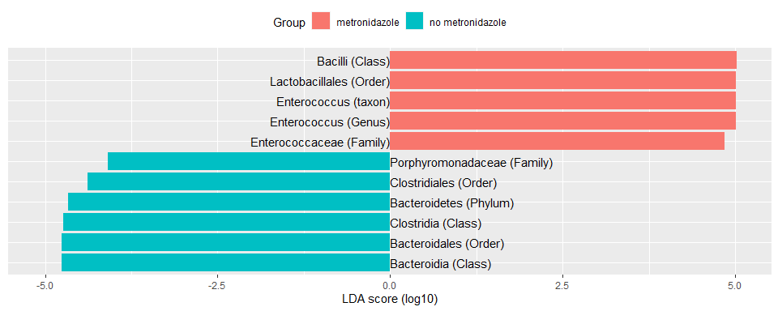
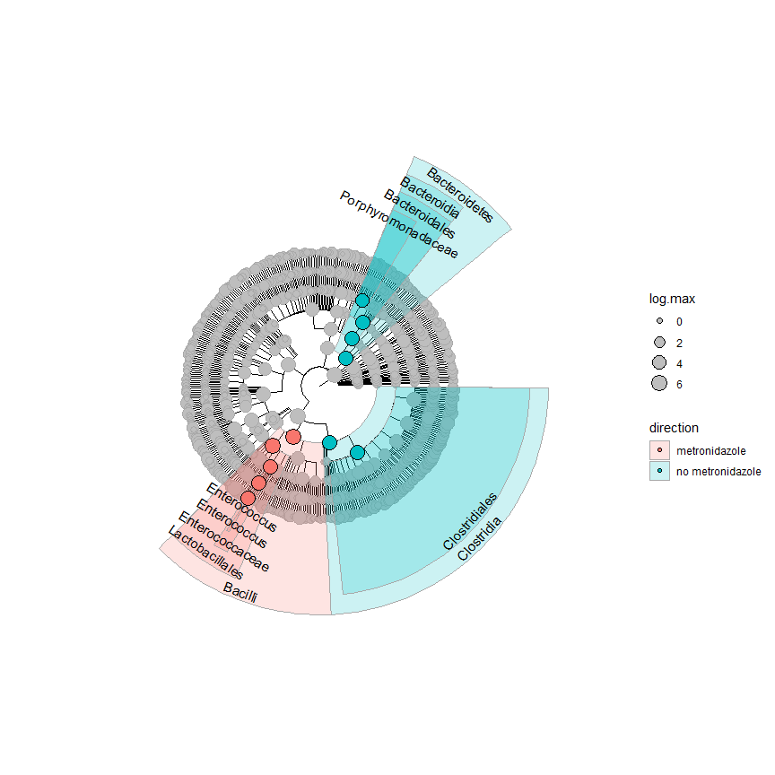

Testing Taxonomic Features
================

Here is a workflow for testing taxonomic features using the
Segata/Huttenhower tool, LEfSE.

``` r
library(tidyverse)
library(yingtools2)
library(phyloseq)
library(ggtree)
```

First create a phyloseq object with the predictors of interest, by
adding variables from `cid.patients`. I am planning to test the
microbiome changes associated with the antibiotic metronidazole.

``` r
phy <- cid.phy
s <- get.samp(phy) %>% left_join(cid.patients,by="Patient_ID") %>%
  mutate(metronidazole=ifelse(metronidazole,"metronidazole","no metronidazole"))
sample_data(phy) <- s %>% set.samp()
```

Use `lda.effect` to test the effect of the variable `metronidazole`.
First it will perform Kruskal-Wallis testing of abundances for each
taxonomic feature. Specify `subclass="sex"` to perform additional
Wilcoxon testing of various subsets across `sex`. Finally, a linear
discriminant analysis (LDA) is performed on taxonomic features selected
by the above testing steps. From this, an effect size is calculated.

``` r
lda <- lda.effect(phy,class="metronidazole",subclass="sex")
lda
```

    ## # A tibble: 1,071 x 8
    ##   taxonomy                                rank pass    lda direction    kw.pvalue log.max info      
    ##   <chr>                                  <int> <lgl> <dbl> <chr>            <dbl>   <dbl> <chr>     
    ## 1 Bacteria                                   1 FALSE    NA metronidazo~   NaN       6     FAIL: KW:~
    ## 2 Bacteria|Acidobacteria                     2 FALSE    NA no metronid~     0.748   0.398 FAIL: KW:~
    ## 3 Bacteria|Acidobacteria|Acidobacteria_~     3 FALSE    NA metronidazo~     0.150   0.271 FAIL: KW:~
    ## 4 Bacteria|Acidobacteria|Acidobacteria_~     4 FALSE    NA metronidazo~     0.150   0.271 FAIL: KW:~
    ## 5 Bacteria|Acidobacteria|Acidobacteria_~     5 FALSE    NA metronidazo~     0.150   0.271 FAIL: KW:~
    ## 6 Bacteria|Acidobacteria|Acidobacteria_~     6 FALSE    NA metronidazo~     0.150   0.271 FAIL: KW:~
    ## 7 Bacteria|Acidobacteria|Acidobacteria_~     7 FALSE    NA metronidazo~     0.150   0.271 FAIL: KW:~
    ## 8 Bacteria|Acidobacteria|Acidobacteria_~     3 FALSE    NA no metronid~     0.487  -0.103 FAIL: KW:~
    ## # ... with 1,063 more rows

A common way to display the data is to plot as horizontal bars:

``` r
lda.plot <- lda %>% filter(pass) %>%
  mutate(lda=if_else(as.numeric(factor(direction))==2,-lda,lda)) %>%
  arrange(lda) %>%
  mutate(taxonomy=fct_inorder(taxonomy))

ggplot(lda.plot,aes(x=taxonomy,y=lda,fill=direction)) + geom_col() + coord_flip()
```

<!-- -->

You can also view the data in a cladogram.

``` r
lvls <- rank_names(phy)
lda.tbl <- lda
for (i in 1:length(lvls)) {
  lvl <- lvls[i]
  lda.tbl[[lvl]] <- str_split(lda.tbl$taxonomy,"\\|") %>% map_chr(~str_c(.[1:i],collapse="|"))
}

lefse.phy <- as.phylo.formula2(~Kingdom/Phylum/Class/Order/Family/Genus/taxon,data=lda.tbl)

gt <- ggtree(lefse.phy,layout="circular")

get.children.yrange <- function(node,gd) {
  hits <- gd$node[gd$parent==node]
  if (length(hits)==0 | node %in% hits) {
    return(gd$y[gd$node==node])
  } else {
    return(unlist(lapply(hits,get.children.yrange,gd)))
  }
}

gd <- gt$data %>% left_join(lda,by=c("label"="taxonomy")) %>%
  mutate(y.range=lapply(node,get.children.yrange,cur_data()),
  ymin=map_dbl(y.range,min),
  ymax=map_dbl(y.range,max),xmin=x,xmax=9+7-x,
  ymid=(ymin+ymax)/2,
  xtext=xmax-0.5,
  angle.label=scales::rescale(ymid,from=range(y),to=c(0,360)),
  angle.label=if_else(is.between(angle.label,0,180),angle.label-90,angle.label+90),
  short.label=map_chr(str_split(label,"\\|"),last))

gt + geom_point(data=gd,aes(size=log.max),color="dark gray",fill="gray",shape=21) +
  geom_point2(data=filter(gd,pass),aes(fill=direction,size=log.max),shape=21) +
  geom_rect(data=filter(gd,pass),aes(xmin=xmin,xmax=xmax,ymin=ymin,ymax=ymax,fill=direction),color="dark gray",alpha=0.2) +
  geom_text(data=filter(gd,pass),aes(x=xtext,y=ymid,label=short.label,angle=angle.label)) + 
  theme(legend.position="right")
```

<!-- -->
