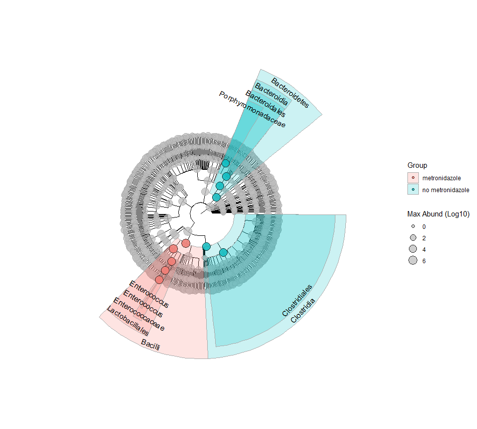

Testing Taxonomic Features
================

Here is a workflow for testing taxonomic features using the
Segata/Huttenhower tool, LEfSe.

``` r
library(tidyverse)
library(yingtools2)
library(phyloseq)
library(ggtree)
```

First create a phyloseq object with the predictors of interest, by
adding variables from `cid.patients`. I am planning to test the
microbiome changes associated with the antibiotic metronidazole.

``` r
phy <- cid.phy
s <- get.samp(phy) %>% left_join(cid.patients,by="Patient_ID") %>%
  mutate(metronidazole=ifelse(metronidazole,"metronidazole","no metronidazole"))
sample_data(phy) <- s %>% set.samp()
```

Use `lda.effect` to test the effect of the variable `metronidazole`.
First it will perform Kruskal-Wallis testing of abundances for each
taxonomic feature. Specify `subclass="sex"` to perform additional
Wilcoxon testing of various subsets across `sex`. Finally, a linear
discriminant analysis (LDA) is performed on taxonomic features selected
by the above testing steps. From this, an effect size is calculated.

``` r
lda <- lda.effect(phy,class="metronidazole",subclass="sex")
```

A common way to display the data is to plot as horizontal bars:

``` r
lda.plot(lda)
```

<!-- -->

You can also view the data in a cladogram, using `lda.clado`.

``` r
lda.clado(lda)
```

<!-- -->
