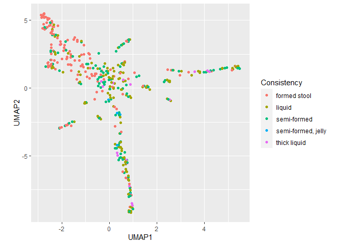

PCoA, tSNE, and UMAP
================

There are more or less three major approaches to data ordination: PCoA,
tSNE, and UMAP. Here is sample code for each.

``` r
library(tidyverse)
library(yingtools2)
library(phyloseq)
```

First, start with a distance matrix. In this example I am calculating
Bray-Curtis distances from the phyloseq object `cid.phy`. Also, prepare
the sample data, which will contain metadata that I might want to plot
by.

``` r
dst <- distance(cid.phy,method="bray")
s <- get.samp(cid.phy)
```

Note that you can calculate distance a variety of metrics, such as
euclidean, Manhattan, unweighted/weighted Unifrac, etc. Also note that
you can start with an OTU/ASV table if you wish, but you will need to
use a `phyloseq` object with a phylogenetic tree in order to calculate
Unifrac.

To perform PCoA:

``` r
pca <- prcomp(dst)
pcadata <- pca$x %>% data.frame() %>% 
  rownames_to_column("sample") %>%
  left_join(s,by="sample")
loadings <- summary(pca)$importance["Proportion of Variance",][1:2]
axis.labels <- paste0(names(loadings)," (",scales::percent(loadings),")")
ggplot(pcadata,aes(x=PC1,y=PC2,color=Consistency)) + 
  geom_point() +
  xlab(axis.labels[1]) + ylab(axis.labels[2]) + 
  theme(aspect.ratio=1)
```

<!-- -->

To perform tSNE:

``` r
library(Rtsne)
tsne <- Rtsne(dst,is_distance=TRUE)
tsnedata <- data.frame(tsne$Y) %>% rename(tSNE1=X1,tSNE2=X2) %>%
  bind_cols(s)
pcadata <- pca$x %>% data.frame() %>% 
  rownames_to_column("sample") %>%
  left_join(s,by="sample")
loadings <- summary(pca)$importance["Proportion of Variance",][1:2]
axis.labels <- paste0(names(loadings)," (",scales::percent(loadings),")")
ggplot(tsnedata,aes(x=tSNE1,y=tSNE2,color=Consistency)) + 
  geom_point() + theme(aspect.ratio=1)
```

<!-- -->

To perform UMAP:

``` r
library(umap)
otu <- get.otu(cid.phy,as.matrix=TRUE) %>% t()
umap <- umap(otu)
umapdata <- umap$layout %>% data.frame() %>% rownames_to_column("sample") %>% 
  rename(UMAP1=X1,UMAP2=X2) %>% left_join(s,by="sample")
ggplot(umapdata,aes(x=UMAP1,y=UMAP2,color=Consistency)) + 
  geom_point() +
  theme(aspect.ratio=1)
```

<!-- -->

Note that UMAP doesn’t take a distance matrix.
