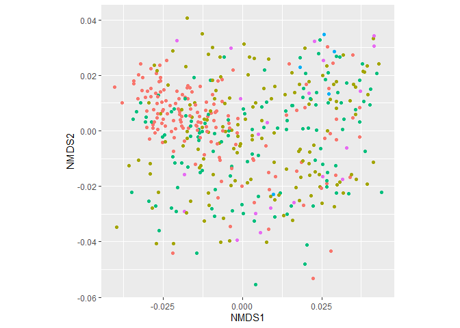

PCoA, tSNE, and UMAP
================

There are more or less three major approaches to data ordination: PCoA,
tSNE, and UMAP. Here is sample code for each.

``` r
library(tidyverse)
library(yingtools2)
library(phyloseq)
library(vegan)
library(scales)
```

First, choose a distance metric to calculate. In this example I am
calculating Bray-Curtis distances from the phyloseq object `cid.phy`.
Also, prepare the sample data, which will contain metadata that I might
want to plot by.

Note that you can calculate distance a variety of metrics, such as
euclidean, Manhattan, unweighted/weighted Unifrac, etc. Also note that
you can start with an OTU/ASV table if you wish, but you will need to
use a `phyloseq` object with a phylogenetic tree in order to calculate
Unifrac.

To perform PCoA:

``` r
s <- get.samp(cid.phy)
pcadata <- ordinate(cid.phy, method = "NMDS", distance = "bray") %>%
  scores(display = "sites") %>%
  as.data.frame() %>%
  rownames_to_column("sample") %>%
  left_join(s, by = "sample")
```

    ## Square root transformation
    ## Wisconsin double standardization
    ## Run 0 stress 0.2631232 
    ## Run 1 stress 0.2785785 
    ## Run 2 stress 0.2851506 
    ## Run 3 stress 0.2863185 
    ## Run 4 stress 0.2809729 
    ## Run 5 stress 0.2823929 
    ## Run 6 stress 0.2688536 
    ## Run 7 stress 0.2783419 
    ## Run 8 stress 0.2796143 
    ## Run 9 stress 0.2783279 
    ## Run 10 stress 0.2860568 
    ## Run 11 stress 0.2816526 
    ## Run 12 stress 0.284078 
    ## Run 13 stress 0.2746745 
    ## Run 14 stress 0.2889965 
    ## Run 15 stress 0.2886998 
    ## Run 16 stress 0.285084 
    ## Run 17 stress 0.2899092 
    ## Run 18 stress 0.26521 
    ## Run 19 stress 0.2741805 
    ## Run 20 stress 0.2863341 
    ## *** No convergence -- monoMDS stopping criteria:
    ##     16: stress ratio > sratmax
    ##      4: scale factor of the gradient < sfgrmin

``` r
ggplot(pcadata, aes(x = NMDS1, y = NMDS2, color = Consistency)) +
  geom_point() +
  theme(aspect.ratio = 1, legend.position = "none")
```

<!-- -->

To perform tSNE:

``` r
library(Rtsne)
dst <- distance(cid.phy, method = "bray")
tsne <- Rtsne(dst, is_distance = TRUE)
tsnedata <- data.frame(tsne$Y) %>%
  rename(tSNE1 = X1, tSNE2 = X2) %>%
  bind_cols(s)
ggplot(tsnedata, aes(x = tSNE1, y = tSNE2, color = Consistency)) +
  geom_point() +
  theme(aspect.ratio = 1)
```

<!-- -->

To perform UMAP:

``` r
library(umap)
otu <- get.otu(cid.phy, as.matrix = TRUE) %>% t()
umap <- umap(otu)
umapdata <- umap$layout %>%
  data.frame() %>%
  rownames_to_column("sample") %>%
  rename(UMAP1 = X1, UMAP2 = X2) %>%
  left_join(s, by = "sample")
ggplot(umapdata, aes(x = UMAP1, y = UMAP2, color = Consistency)) +
  geom_point() +
  theme(aspect.ratio = 1)
```

<!-- -->

Note that UMAP doesn’t use a distance metric.
