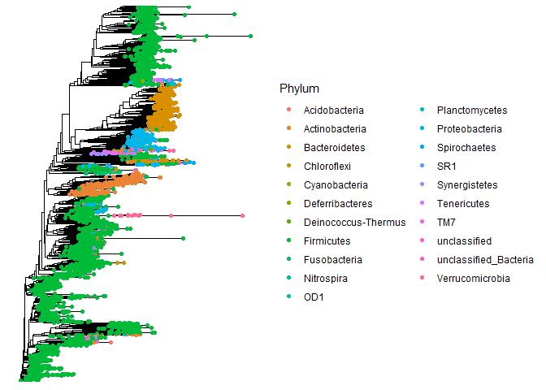
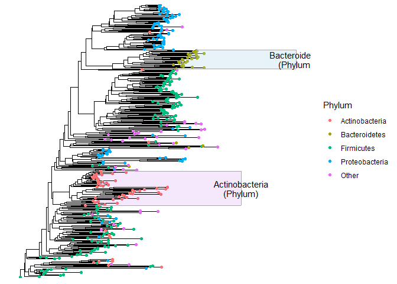

Phylogenetic Trees
================

Here I am describing my workflow to create plots of phylogenetic trees.
To make phylogenetic trees in R, the `ggtree` package is reasonably good
and flexible for our purposes.

``` r
library(tidyverse)
library(yingtools2)
library(phyloseq)
library(ggtree)
```

Tree data is most commonly stored as a `phylo` object in R. These can be
stored within `phyloseq` objects as a part of the data. Using `cid.phy`
data as an example, the `phylo` object can be extracted using
`phy_tree()` function.

This works with the `phylo` object, which is the most common way to
store phylogenetic trees in R.

``` r
tr <- phy_tree(cid.phy)
tr
```

    ## 
    ## Phylogenetic tree with 5327 tips and 5326 internal nodes.
    ## 
    ## Tip labels:
    ##   Otu384, Otu6413, Otu6077, Otu4374, Otu1862, Otu6298, ...
    ## Node labels:
    ##   G14FS2B02ETUNI, , , , , , ...
    ## 
    ## Rooted; includes branch lengths.

Use the `ggtree()` function to create a `ggtree` object. This is
essentially a custom `ggplot` object which can be further modified and
tweaked with additional steps.

``` r
ggtree(tr)
```

<!-- -->

You can tweak the appearance by specifying `layout`:

``` r
ggtree(tr,layout="circular") + ggtitle("circular")
ggtree(tr,layout="dendrogram") + ggtitle("dendrogram")
ggtree(tr,layout="ape") + ggtitle("ape")
```


You can assign useful taxonomic data to the `ggtree` object by using the
`%<+%` operator, which is specific to the `ggtree` package. Like other
`ggplot` objects, there is actually a data frame stored within the
`ggtree` object which can be used for plotting. I like to save this as a
separate object (`gd`), which makes downstream customizations a little
easier. If you examine this, you’ll start to understand what `ggtree` is
doing.

``` r
gt <- ggtree(tr) %<+% get.tax(cid.phy)
gd <- gt$data
gd
```

    ## # A tibble: 10,653 x 16
    ##   parent  node branch.length label  isTip      x     y  branch  angle Kingdom Phylum  Class  Order  
    ##    <int> <int>         <dbl> <chr>  <lgl>  <dbl> <dbl>   <dbl>  <dbl> <chr>   <chr>   <chr>  <chr>  
    ## 1   5328     1       0.0112  Otu384 TRUE  0.0112     1 0.00559 0.0676 Bacter~ Firmic~ Clost~ Clostr~
    ## 2   5335     2       0.0147  Otu64~ TRUE  0.0182    49 0.0109  3.31   Bacter~ Firmic~ Clost~ Clostr~
    ## 3   5336     3       0.0117  Otu60~ TRUE  0.0181    50 0.0122  3.38   Bacter~ Firmic~ Clost~ Clostr~
    ## 4   5336     4       0.0115  Otu43~ TRUE  0.0179    51 0.0121  3.45   Bacter~ Firmic~ Clost~ Clostr~
    ## 5   5337     5       0.00304 Otu18~ TRUE  0.0123    47 0.0108  3.18   Bacter~ Firmic~ Clost~ Clostr~
    ## 6   5337     6       0.0142  Otu62~ TRUE  0.0235    48 0.0164  3.24   Bacter~ Firmic~ Clost~ Clostr~
    ## 7   5339     7       0.0116  Otu30~ TRUE  0.0180    52 0.0122  3.51   Bacter~ Firmic~ Clost~ Clostr~
    ## 8   5339     8       0.0116  Otu63~ TRUE  0.0180    53 0.0123  3.58   Bacter~ Firmic~ Clost~ Clostr~
    ## # ... with 10,645 more rows

If I wanted to plot points at each tip, I can add the layer in usual
ggplot2 fashion.

``` r
gt + geom_point(aes(color=Phylum))
```

<!-- -->

Because I only want to plot the tips, I can use `geom_point2`, which
simply allows subsetting of the data in a convenient way.

``` r
gt + geom_point2(aes(subset=isTip,color=Phylum))
```

<!-- -->

Let’s cover a few more details. I’d like to plot where tips are at genus
level (the one above was at OTU/ASV level), so use `phy.collapse` to
create a genus-level tree. There are too many Phylum level colors,
collapse the small ones into “Other Phyla”.

``` r
phy.genus <- cid.phy %>% phy.collapse(taxranks=c("Kingdom","Phylum","Class","Order","Family","Genus"))
tr <- phy_tree(phy.genus)
gt <- ggtree(tr) %<+% get.tax(phy.genus)
gd <- gt$data %>% mutate(Phylum=fct_lump_n(Phylum,4))
gt + geom_point2(data=gd,aes(subset=isTip,color=Phylum))
```

<!-- -->

``` r
otu <- phy.genus %>% get.otu.melt(filter.zero=TRUE)
gt + geom_point2(data=gd,aes(subset=isTip,color=Phylum))
```

<!-- -->
