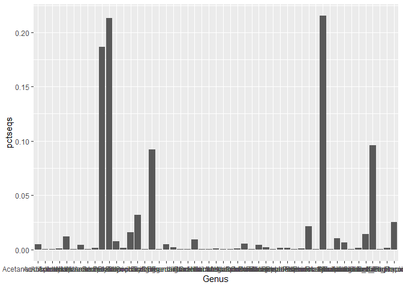
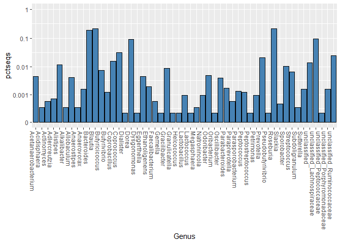

Tax Barplot
================

Here we will create a barplot for a composition of a single sample.

``` r
library(tidyverse)
library(yingtools2)
library(phyloseq)
```

Let’s say I want to plot patient 301 from the `cid.phy` data. Start by
subsetting the `cid.phy` object. Whenever you subset, you may want to
prune off the unused taxa (i.e. taxa that don’t appear in the subsetted
data).

``` r
physub <- cid.phy %>% prune_samples("173A",.) %>% 
  phy.collapse(taxranks="Genus") %>%
  prune_taxa(taxa_sums(.)>0,.)
otusub <- get.otu.melt(physub)
```

Now plot a bar for each Genus level:

``` r
ggplot(otusub,aes(x=Genus,y=pctseqs)) + geom_col()
```

<!-- -->

Great, now perform a few adjustments: (a) Log transform the Y-axis so
that low abundances are visible (I use `log_epsilon_trans`), (b) divide
into to facets to show phylum level, (b) expand the plot to include
relative abundance of 100%, (c) rotate and left-justify the X-axis
labels.

``` r
ggplot(otusub,aes(x=Genus,y=pctseqs)) + geom_col(fill="steelblue",color="black") + 
  scale_y_continuous(trans=log_epsilon_trans(0.001),limits=c(0,1)) +
  theme(axis.text.x=element_text(angle=-90,hjust=0))
```

<!-- -->
